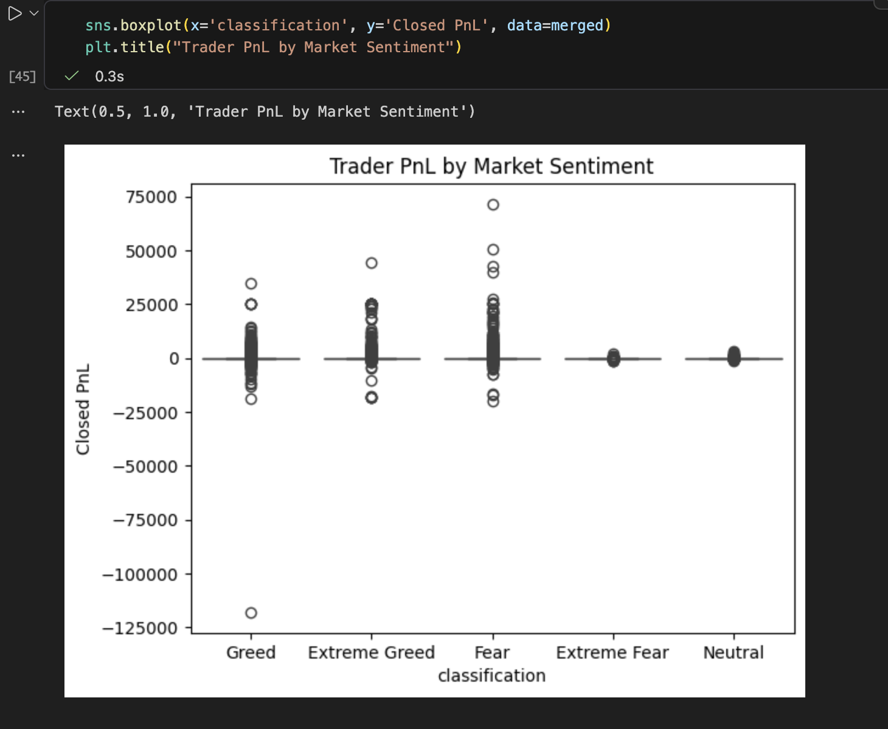

# Trader Behavior vs Market Sentiment Analysis

## PnL Distribution by Market Sentiment



## Overview

This project analyzes how cryptocurrency trader behavior changes based on market sentiment using the **Fear & Greed Index** and **Hyperliquid historical trading data**.

The objective is to identify patterns in trader profitability, trade frequency, and risk-taking behavior under different market sentiment conditions such as **Fear**, **Greed**, and **Extreme Fear/Greed**.

---

## Dataset

Two datasets were used in this analysis:

1. **Bitcoin Market Sentiment Dataset**

   * Contains daily Fear & Greed index values.
   * Provides sentiment classification such as *Fear*, *Greed*, and *Neutral*.

2. **Hyperliquid Historical Trader Data**

   * Contains detailed trading activity including:

     * Account ID
     * Trade size
     * Direction (Long / Short)
     * Closed Profit & Loss (PnL)
     * Timestamp

---

## Data Processing

The following steps were performed:

1. Loaded both datasets using **pandas**
2. Converted timestamps into date format
3. Merged trading data with sentiment data using the date column
4. Cleaned missing values
5. Generated additional features such as:

   * Win/Loss indicator
   * Daily PnL
   * Trader activity metrics

---

## Analysis Performed

Several analyses were conducted to understand trader behavior:

* **PnL Distribution by Market Sentiment**
* **Trade Frequency by Sentiment**
* **Trade Size vs Sentiment**
* **Win Rate Analysis**
* **Daily PnL Trends**

Visualizations were created using **Matplotlib** and **Seaborn**.

---

## Key Insights

1. **Higher volatility during extreme sentiment**

   * Trader PnL fluctuates more during **Extreme Fear** and **Extreme Greed**.

2. **Increased trading activity during Greed**

   * Traders tend to execute more trades when the market sentiment is **Greed**.

3. **Higher risk-taking during Extreme Greed**

   * Trade sizes are generally larger when sentiment reaches **Extreme Greed** levels.

---

## Strategy Recommendations

Based on the analysis, the following strategies are suggested:

1. **Risk Reduction During Extreme Fear**

   * Reduce leverage and position sizes to manage drawdowns.

2. **Controlled Trading During Greed**

   * Increased trading opportunities exist, but risk management is necessary.

---

## Tools & Libraries Used

* Python
* pandas
* matplotlib
* seaborn
* Jupyter Notebook / VS Code

---

## Project Structure

```
trader-sentiment-analysis
│
├── notebook.ipynb
├── README.md
└── data
```

---

## Conclusion

This analysis demonstrates that **market sentiment significantly influences trader behavior and profitability patterns**. Understanding these relationships can help design more effective trading strategies and improve risk management.
